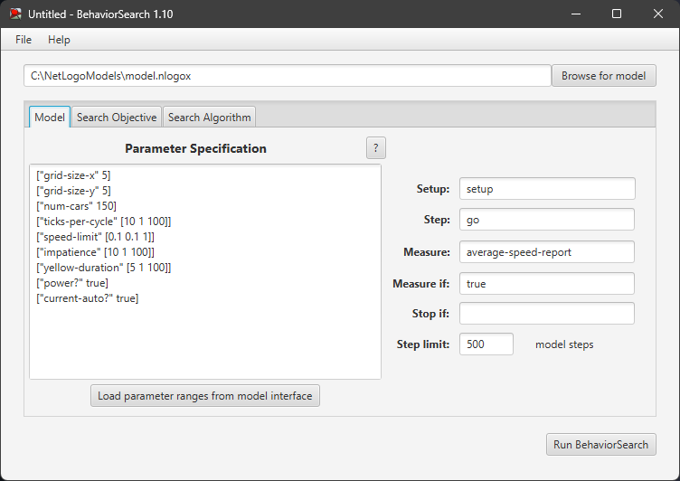
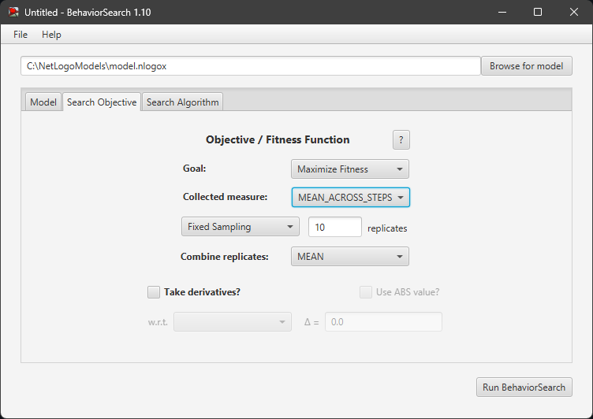
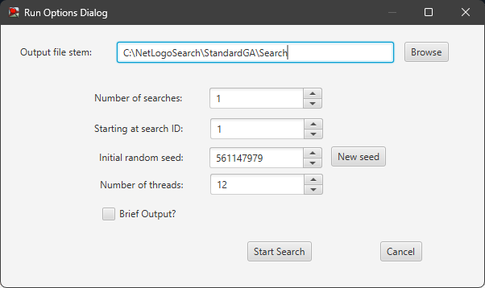
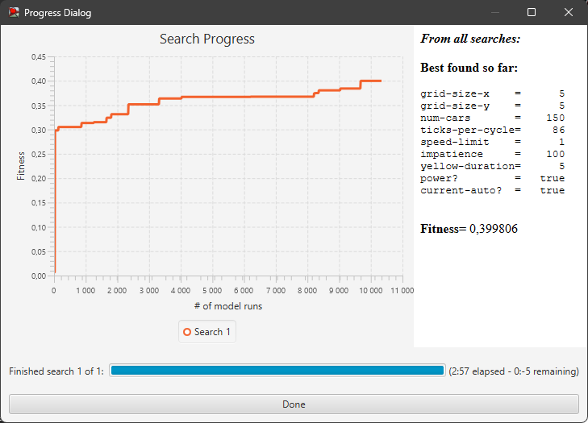
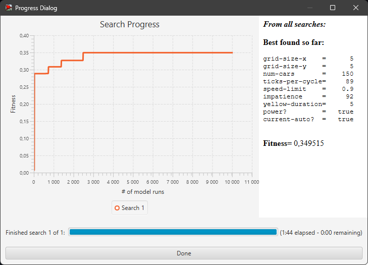
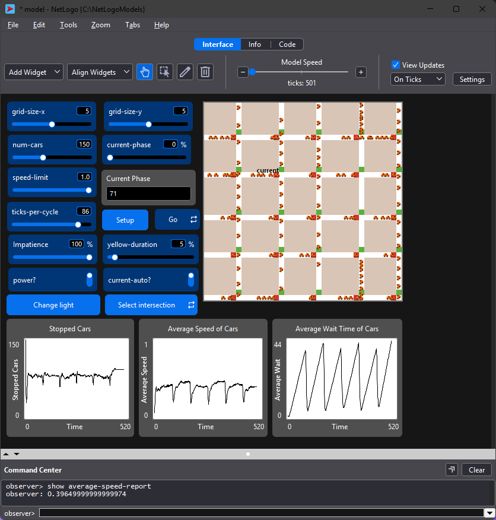

## Комп'ютерні системи імітаційного моделювання
## СПм-24-3, **Амосов Дмитро Олександрович**
### Лабораторна робота №**3**. Використання засобів обчислювального інтелекту для оптимізації імітаційних моделей

 

### Варіант 1, модифікована модель Traffic Grid з попередньої лабораторної роботи:
[Traffic Grid](model.nlogox)

#### Вербальний опис моделі:  
Ускладнена версія моделі [Traffic Grid](http://www.netlogoweb.org/launch#http://www.netlogoweb.org/assets/modelslib/Sample%20Models/Social%20Science/Traffic%20Grid.nlogo). Симуляція руху автомобілів у міській сітці доріг, що регулюється світлофорами. Кожен автомобіль є агентом, який рухається по дорогах, дотримуючись наступних правил: зупиняється на червоне світло та перед автомобілем, що стоїть попереду. Світлофори на перехрестях перемикаються автоматично з певною періодичністю або можуть бути вимкнені.

Модель враховує «людський фактор»:
- Тип водія: деякі водії є «нетерплячими» (impatient) і намагаються проскочити перехрестя на жовте світло.
- Час реакції: водії не стартують миттєво на зелене світло, а мають затримку реакції.

Модель дозволяє досліджувати виникнення заторів, вплив синхронізації світлофорів та поведінки водіїв на загальну пропускну здатність мережі.

#### Керуючі параметри:

- **grid-size-x** та **grid-size-y** визначають кількість доріг (розмір сітки кварталів) по горизонталі та вертикалі відповідно.
- **num-cars** визначає кількість агентів (автомобілів) у середовищі моделювання.
- **power?** перемикач, що вмикає або вимикає роботу світлофорів. Якщо вимкнено — світлофори не працюють (вільний рух з обох напрямів), і машини керуються лише правилом "перешкоди попереду".
- **ticks-per-cycle** визначає частоту зміни сигналів світлофора (тривалість циклу "зелений-червоний").
- **speed-limit** обмеження максимальної швидкості руху для всіх автомобілів.
- **yellow-duration.** Тривалість жовтого сигналу світлофора.
- **impatience.** Ймовірність, що водій виявиться «нетерплячим». Такий водій ігнорує жовте світло.

#### Показники роботи модеі:

- **Stopped Cars** — кількість автомобілів, швидкість яких дорівнює 0 на даному такті.
- **Average Speed** — середня швидкість усіх автомобілів.
- **Average Wait Time** — середній час очікування автомобілів у заторі.

 

### Налаштування середовища BehaviorSearch:

**Обрана модель**:
<pre>
C:\NetLogoModels\model.nlogox
</pre>
**Параметри моделі**:  
<pre>
["grid-size-x" 5]
["grid-size-y" 5]
["num-cars" 150]
["ticks-per-cycle" [10 1 100]]
["speed-limit" [0.1 0.1 1]]
["impatience" [10 1 100]]
["yellow-duration" [5 1 100]]
["power?" true]
["current-auto?" true]
</pre>  
Використовувана **міра**:  
Для фітнес-функції було обрано **значення середньої швидкості всіх машин**, оскільки одною з цілей дослідження данної моделі є пошук оптимальних налаштувань для максимізації її пропускної здатності, вираз для її розрахунку взято з налаштувань графіка аналізованої імітаційної моделі в середовищі NetLogo та використано в окремому методі для уникнення помилок:
<pre>
to-report average-speed-report
  ifelse any? turtles 
  [
    report mean [speed] of turtles
  ]
  [
    report 0
  ]
end
</pre>
який було вказано у параметрі "**Measure**":
<pre>
average-speed-report
</pre>

Середня швидкість враховується **в середньому** за весь період симуляції, тривалістю 500 тактів.
Загальний вигляд вкладки налаштувань параметрів моделі:  

**Налаштування цільової функції**:  

Метою підбору параметрів є **максимізація** середньої швидкості руху — це вказано через параметр "**Goal**" зі значенням **Maximize Fitness**.
Для обліку показника вибрано метод **MEAN_ACROSS_STEPS** (середнє значення за всі такти симуляції).
Кожна симуляція повторюється по **10 разів**, щоб уникнути впливу випадкового розташування машин на старті та випадкової затримки реакції, яка закладена в код моделі.
Загальний вигляд вкладки налаштувань цільової функції:  

**Налаштування алгоритму пошуку**:  

Загальний вид вкладки налаштувань алгоритму пошуку:

 

### Результати використання BehaviorSearch:
Діалогове вікно запуску пошуку:  

Результат пошуку параметрів імітаційної моделі, використовуючи **генетичний алгоритм**:  

Результат пошуку параметрів імітаційної моделі, використовуючи **випадковий пошук**:  

Порівнюючи результати можно побачити що генетичний алгоритм краще впорався з задачею і знайшов кращі параметри за виділену кількість спроб, однак випадковий пошук швидше знайшов свій фінальний результат

Отримані параметри імітаційної моделі при тестуванні дають очікуваний результат і імітаційна модель працює коректно.